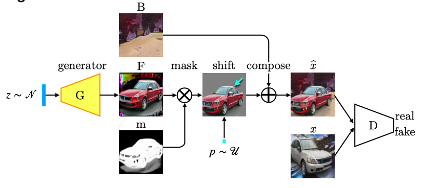
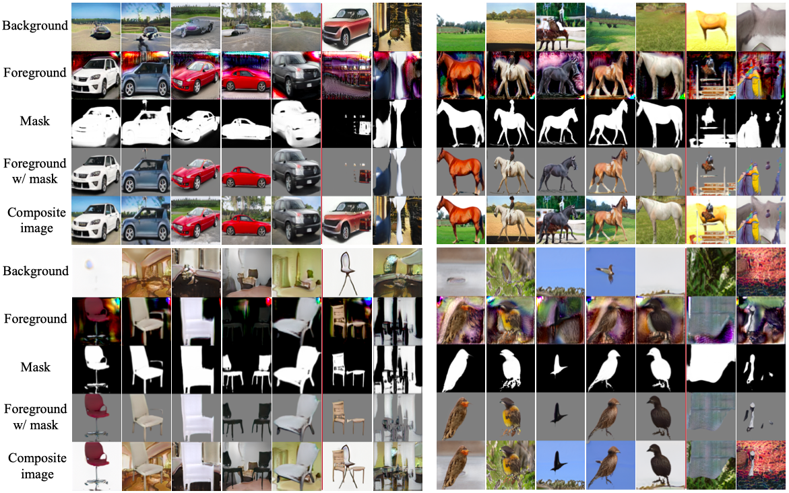

# Emergence of Object Segmentation in Perturbed Generative Models

Code for NeurIPS 2019 paper [Emergence of Object Segmentation in Perturbed Generative Models](https://arxiv.org/abs/1905.12663).





## Usage

Tested with PyTorch version 1.2.0.

Download [LSUN object dataset](https://www.yf.io/p/lsun).

Sample train command for the layered generative model:

```
python train.py --max_size 128 --location_jitter 0.125 --min_mask_coverage 0.25 --mask_alpha 2.0 --mixing -d lsun /path/to/lmdb/ --bg_contrast_jitter 0.3 --org_to_crop 1.125 --sched
```


## Credits

StyleGAN implementation used in this repository is based on this [PyTorch port](https://github.com/rosinality/style-based-gan-pytorch) by [rosinality](https://github.com/rosinality).